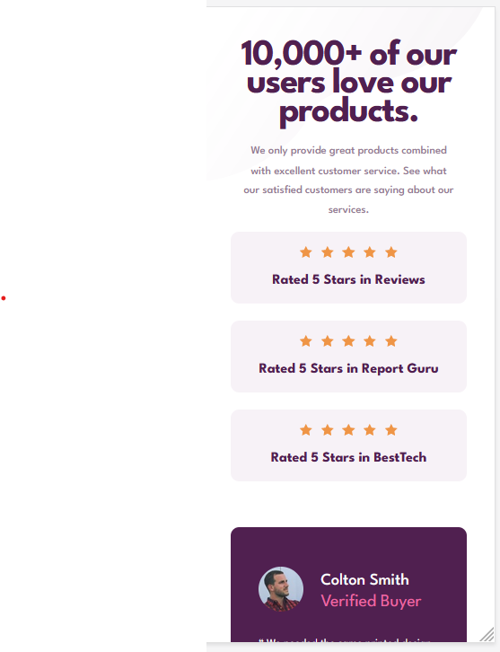
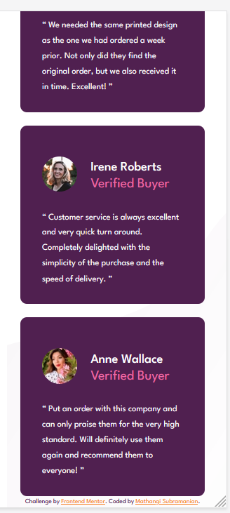

# Frontend Mentor - Social proof section solution

This is a solution to the [Social proof section challenge on Frontend Mentor](https://www.frontendmentor.io/challenges/social-proof-section-6e0qTv_bA). Frontend Mentor challenges help you improve your coding skills by building realistic projects. 

## Table of contents

- [Overview](#overview)
  - [The challenge](#the-challenge)
  - [Screenshot](#screenshot)
  - [Links](#links)
- [My process](#my-process)
  - [Built with](#built-with)
  - [What I learned](#what-i-learned)
  - [Continued development](#continued-development)
  - [Useful resources](#useful-resources)
- [Author](#author)
- [Acknowledgments](#acknowledgments)

## Overview
### The challenge

Your users should be able to:

- View the optimal layout for the section depending on their device's screen size

### Screenshot

### 
Desktop view
 

### 
Mobile View
 

# 
### Links

- Solution URL : [Git URL](https://github.com/mathangisd/social-proof-section.git)

- Live URL : [Social Proof Section on Netlify](https://socialproof-section-msd.netlify.app/)

## My process
### Built with

- Semantic HTML5 markup
- CSS custom properties
- CSS Grid
- CSS Flexbox

### What I learned

This challenge helped me get a good understanding of css grid and flexbox properties. I learned how to style blockquote and was able to use nth-of-type.

### Continued-Development
I would like to work on projects with different layouts and focus on making them responsive.

### Useful resources

- [Quoting in HTML: Quotations, Citations, and Blockquotes](https://css-tricks.com/quoting-in-html-quotations-citations-and-blockquotes/#:~:text=You%20can%20add%20quotation%20marks,don't%20automatically%20add%20them.) by 
John Rhea

## Author
- Website - [Mathangi Subramanian](https://github.com/mathangisd)
- Frontend Mentor - [mathangisd](https://www.frontendmentor.io/profile/mathangisd)

## Acknowledgments
Thank you to anyone for giving any feedback, it is always helpful to know how the code could be improved.
